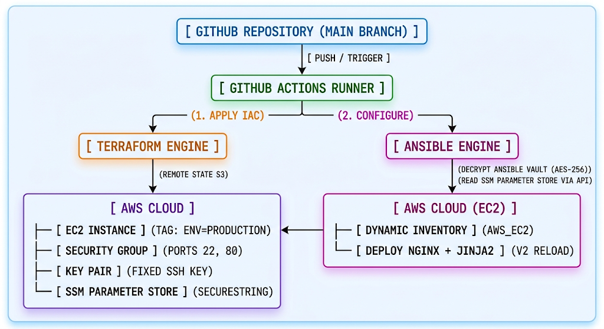

# AWS Infrastructure & Automated Configuration with Terraform, Ansible & GitHub Actions

[](https://www.terraform.io/)
[](https://www.ansible.com/)
[](https://github.com/features/actions)
[](LICENSE)

🇪🇸 [Spanish version and more info](README-es.md)

  

+ End-to-end automated GitOps pipeline that provisions AWS infrastructure using Terraform, configures server environments using Ansible dynamic inventories, and enforces DevSecOps checks via GitHub Actions.


## Table of contents

- [Architecture Decisions](#architecture-decisions)
- [CI/CD Pipeline](#cicd-pipeline)
- [Infrastructure Verification](#infrastructure-verification)
- [How to install and run the project](#how-to-install-and-run-the-project)
- [How to use the project](#how-to-use-the-project)`
- [Stack](#stack)
- [Status](#status)
- [Author](#author)


## Architecture Decisions

* **Decoupled Provisioning & Configuration:** Uses Terraform strictly for immutable infrastructure provisioning (VPC, EC2, Security Groups) and hands off stateful OS/application configuration to Ansible.
* **Dynamic Inventory Integration:** Ansible queries AWS via `amazon.aws.aws_ec2` plugin using resource tags, eliminating hardcoded host IP addresses in inventories.
* **State Management & Locking:** Terraform state is stored securely in an Amazon S3 backend with DynamoDB table locking to prevent concurrent pipeline runs.
* **Least-Privilege CI/CD Credentials:** GitHub Actions connects to AWS using OpenID Connect (OIDC) federated roles, avoiding long-lived IAM access keys stored in secrets.


## CI/CD Pipeline

+ The main objective of this project is to demonstrate seamless integration between **Terraform** (infrastructure provisioning) and **Ansible** (service configuration), eliminating dependencies on static IP addresses through **Dynamic Inventories**, ensuring uninterrupted deployments (*Graceful Reload*), and protecting sensitive data in the cloud.

+ The GitHub Actions workflow executes on every Push and Pull Request to `main`:
    1. **Linting & Code Quality:** Runs `terraform fmt -check` and `ansible-lint` to ensure coding standards.
    2. **Security Scanning (SAST):** Scans IaC definitions for security misconfigurations using static analysis tools.
    3. **Plan & Pull Request Comment:** Executes `terraform plan` and automatically posts the generated execution diff onto the PR for peer review.
    4. **Controlled Apply:** Infrastructure changes and Ansible playbooks run automatically only after merging into `main`.


## Infrastructure Verification

* **Automated Ansible Playbook Execution:**
  Pipeline output demonstrating successful Ansible configuration run against dynamically discovered AWS instances:
    
  

* **Deployment Verification:**
  HTTP request confirming the application and web server configured by Ansible are fully operational:
  

+ HTTP Response from the Production Server:
  

+ HTTP Response from the Production Server (v2):
  

+ Clean Infrastructure Destruction:
  


## How to install and run the project

### Option A: Automated Deployment via GitHub Actions (GitOps)
+ The repository is configured to trigger automated infrastructure and configuration pipelines on code changes.

1. **Fork or Clone the repository:**
```bash
git clone https://github.com/mamoros-dev/aws-ansible-gitops-pipeline.git

cd aws-ansible-gitops-pipeline
```
2. Set up the following Repository Secrets in your GitHub repository:
    - AWS_ACCESS_KEY_ID
    - AWS_SECRET_ACCESS_KEY
    - ANSIBLE_VAULT_PASSWORD
    - SSH_PUBLIC_KEY
    - SSH_PRIVATE_KEY

3. Trigger via Pull Request / Commit:
    - Push changes to any branch or open a Pull Request targeting `main`. The pipeline automatically validates syntax, runs security scans, and posts the `terraform plan` output as a PR comment.
    - Merge into `main`: Upon merging, the pipeline executes `terraform apply` to update the infrastructure and automatically runs the Ansible playbooks against the newly provisioned EC2 instances via dynamic inventory.

### Option B: Manual CLI Deployment (Step-by-Step)

+ If you prefer to deploy and test the environment directly from your local terminal without GitHub Actions:

1. Provision Infrastructure with Terraform:
```Bash
cd iac
terraform init
terraform plan
terraform apply -auto-approve
```
> Terraform will output the infrastructure details and tag the EC2 instances appropriately for Ansible discovery.

2. Execute Configuration Management with Ansible:
```bash
# Ensure your private SSH key is added or accessible by Ansible.

# Create your local Vault password file (do NOT commit this file):
echo "your_vault_password" > iac/.vault_password

# Ensure iac/roles/nginx_webserver/vars/main.yml contains the required variables or encrypted secrets (site_title, db_user, db_password, api_key_servicio).

# Verify that the AWS dynamic inventory plugin discovers the target instances
cd ../
ansible-inventory -i ./iac/aws_ec2.yml --graph

# Run the playbook to provision application dependencies and configurations
ansible-playbook -i ./iac/aws_ec2.yml ./iac/site.yml

# Provisioning with Ansible Using Dynamic Inventory
ansible-playbook -i ./iac/aws_ec2.yml ./iac/site.yml --vault-password-file iac/.vault_password
```

## How to Use the Project

+ Once deployed (either manually or via GitHub Actions), you can interact with and verify the system using the following steps:

    **1. Test Application & Endpoint Access:**  
    Retrieve the public DNS or IP address of the deployed resources (from Terraform outputs or AWS Console) and query the endpoint:
    ```bash
    curl -i http://<your-ec2-public-ip-or-alb-dns>
    ```

    **2. Making Infrastructure or Configuration Changes:**  
    To update the system using the GitOps workflow:
    - To modify infrastructure: Edit the .tf files in the terraform/ directory.
    - To modify OS/App configuration: Update the playbooks or roles in the ansible/ directory.
    - Push your changes:
    ```Bash
    git checkout -b feature/update-config
    git commit -m "feat(ansible): update Nginx configuration template"
    git push origin feature/update-config
    ```
    > Inspect the automated plan generated in your GitHub Pull Request before merging to apply changes live.

    **3. Environment Teardown (Cleanup):**  
    To destroy all provisioned AWS resources and avoid unexpected charges:
    - **Via Local CLI:**
    ```Bash
    cd iac
    terraform destroy -auto-approve
    ```
    - **Via GitHub Actions (Optional):**  
    Trigger the manual `workflow_dispatch` destroy pipeline configured in `.github/workflows/destroy.yml`.

## Stack
+ Terraform 1.15 · AWS  · GitHub Actions · OIDC · GitHub Environments

## Status
+ Infrastructure and process completed and verified from start to finish
+ Infrastructure is removed after validation to avoid unnecessary credit consumption. 

## Author
+ Miguel — [GitHub](https://github.com/mamoros-dev) · [LinkedIn](https://www.linkedin.com/in/miguel-amoros-moret/)