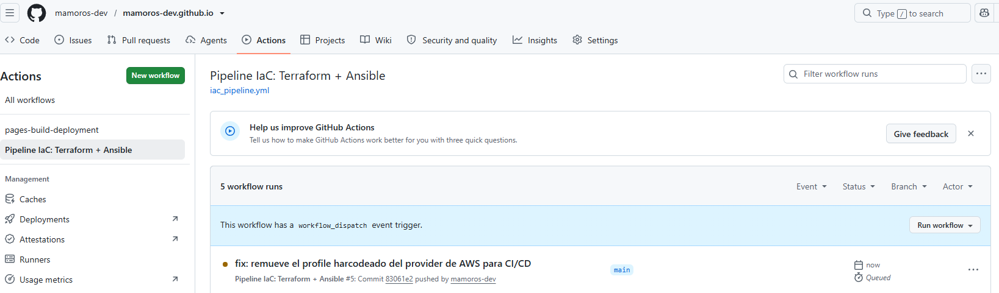
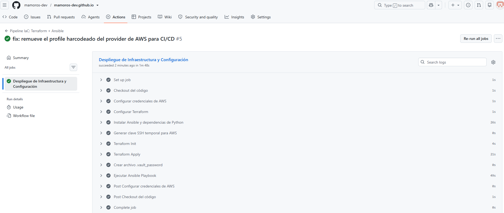
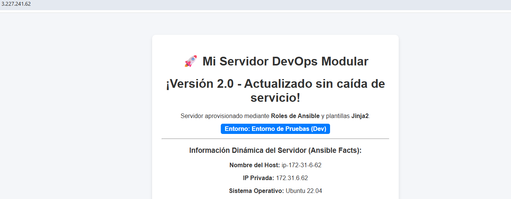

# AWS Infrastructure & Automated Configuration with Terraform, Ansible & GitHub Actions

+ Un pipeline completo de Infraestructura como Código (IaC) y Gestión de Configuración que despliega de forma automática una arquitectura web en AWS, aprovisiona un servidor Nginx con plantillas dinámicas Jinja2, gestiona secretos cifrados con Ansible Vault / AWS SSM Parameter Store y automatiza el flujo completo mediante GitHub Actions.

+ Automatización de infraestructura en la nube AWS combinando **Terraform** para el orquestado IaaS con **estado remoto en S3**, **Ansible** para la gestión de configuración PaaS mediante inventario dinámico, y **GitHub Actions** como orquestador CI/CD GitOps.

+ El proyecto implementa un patrón de seguridad con **Ansible Vault** y **AWS Systems Manager Parameter Store (SSM)** para evitar la exposición de credenciales en el repositorio.

---

## 📐 Arquitectura del Sistema

+ El objetivo principal de este proyecto es demostrar una integración limpia entre **Terraform** (aprovisionamiento de infraestructura) y **Ansible** (configuración de servicios), eliminando dependencias de IPs estáticas mediante **Inventarios Dinámicos**, garantizando despliegues sin interrupción (*Graceful Reload*) y protegiendo datos sensibles en la nube.

```plaintext
                                    ┌──────────────────────────────────┐
                                    │  GitHub Repository (main branch) │
                                    └────────────────┬─────────────────┘
                                                     │ (push / trigger)
                                                     ▼
                                    ┌──────────────────────────────────┐
                                    │     GitHub Actions Runner        │
                                    └─────────┬──────────────┬─────────┘
                                              │              │
                      ┌───────────────────────┘              └───────────────────────┐
                      │ (1. Apply IaC)                                               │ (2. Configure)
                      ▼                                                              ▼
        ┌──────────────────────────┐                                   ┌──────────────────────────┐
        │     Terraform Engine     │                                   │      Ansible Engine      │
        └─────────────┬────────────┘                                   └─────────────┬────────────┘
                      │ (Remote State S3)                                            │
                      ▼                                                              ▼
┌───────────────────────────────────────────┐                       ┌───────────────────────────────────────────┐
│                 AWS Cloud                 │                       │              AWS Cloud (EC2)              │
│                                           │                       │                                           │
│  ├── EC2 Instance (Tag: Env=production)   │◄──────────────────────┼─── Dynamic Inventory (aws_ec2)            │
│  ├── Security Group (Ports 22, 80)        │                       │   ├── Decrypts Ansible Vault (AES-256)    │
│  ├── Key Pair (Clave SSH Fija)            │                       │   ├── Reads SSM Parameter Store via API   │
│  └── SSM Parameter Store (SecureString)   │                       │   └── Deploys Nginx + Jinja2 (v2 Reload) │
└───────────────────────────────────────────┘                       └───────────────────────────────────────────┘
```

## 🔑 Componentes Clave
- **Orquestación IaaS:** Terraform declara la instancia EC2, Security Groups y Key Pairs en la región `us-east-1` persistiendo el estado en S3.
- **Configuración PaaS:** Ansible gestiona la instalación de Nginx mediante un Rol modular, plantillas Jinja2 y recarga del servicio en caliente (Handlers).
- **Inventario Dinámico:** El plugin `amazon.aws.aws_ec2` descubre automáticamente las IPs públicas de las instancias filtrando por etiquetas (`Environment: production` / `Role: webservers`).
- **Gestión de Secretos Híbrida:**
    - **Ansible Vault:** Cifrado simétrico (AES-256) para datos estáticos del repositorio.
    - **AWS SSM Parameter Store:** Lectura en tiempo real de variables `SecureString` cifradas con AWS KMS.
- **GitOps & Zero Downtime:** Integración con GitHub Actions usando claves SSH persistentes para aplicar cambios en caliente sin recrear la infraestructura innecesariamente.

## 🛠️ Stack Tecnológico
- **Cloud Provider:** AWS (EC2, Security Groups, SSM Parameter Store, KMS, S3 Backend).
- **IaC & Config Management:** Terraform, Ansible (Roles, Jinja2, Ansible Vault).
- **CI/CD & SCM:** GitHub Actions, Git.
- **Runtime:** Python 3, Boto3, Botocore.

## 📁 Estructura del Proyecto

```bash
aws-ansible-gitops-pipeline/
├── .github/
│   └── workflows/
│       ├── iac_pipeline.yml     # Workflow de despliegue continuo
│       └── iac_pipeline_destroy.yml          # Workflow de destrucción bajo demanda
├── .gitignore                   # Archivo de exclusiones de Git
├── README.md                    # Documentación del proyecto
├── docs/
│   └── images/                  # Capturas de prueba de ejecución
│       ├── pipeline_completed.png
        ├── pipeline_destroy.png
        ├── pipeline_run.png
        ├── pipeline.png
│       ├── secrets.png
│       ├── webv1.png
│       └── webv2.png
└── iac/                         # Carpeta raíz de la infraestructura
    ├── ansible.cfg              # Configuración de Ansible (host_key_checking = False)
    ├── aws_ec2.yml              # Configuración del Inventario Dinámico AWS
    ├── main.tf                  # Código de Terraform (EC2, SG, KeyPair, S3 Backend)
    ├── site.yml                 # Playbook principal de Ansible
    └── roles/
        └── nginx_webserver/     # Rol modular para Nginx y plantillas Jinja2
```

## 🔧 Prerrequisitos
+ Si deseas ejecutar el proyecto de forma local en tu máquina o WSL:
    - AWS CLI configurado con credenciales (aws configure).
    - Terraform >= v1.5.0
    - Ansible >= v2.15.0
    - Colección de AWS para Ansible instalada: `ansible-galaxy collection install amazon.aws`
    - Librerías de Python requeridas:
    ```bash
    python -m pip install --upgrade pip
    pip install --user ansible boto3 botocore
    ansible-galaxy collection install amazon.aws
    ```

## 🚀 Cómo Levantarlo
+ Vía GitOps (Recomendado)
    1. Configura en tu repositorio de GitHub los siguientes Repository Secrets:
        - AWS_ACCESS_KEY_ID
        - AWS_SECRET_ACCESS_KEY
        - ANSIBLE_VAULT_PASSWORD
        - SSH_PUBLIC_KEY
        - SSH_PRIVATE_KEY
    2. Realiza un `git push` a la rama `main` modificando cualquier archivo dentro del directorio `iac/`.

+ Vía Terminal Local (WSL2):
    ```bash
    cd iac/

    # 1. Crear el archivo de desencriptación local
    echo "tu_password_vault" > .vault_password

    # 2. Desplegar la infraestructura con Terraform
    terraform init
    terraform apply -auto-approve

    # 3. Provisionar con Ansible usando Inventario Dinámico
    ansible-playbook -i ./iac/aws_ec2.yml ./iac/site.yml --vault-password-file .vault_password

    # 4. Destruir recursos al finalizar
    terraform destroy -auto-approve
    ```

## 🌐 Infraestructura Desplegada y Funcionando
+ El pipeline automatizado despliega de forma transparente:
    - Una instancia EC2 Ubuntu Server.
    - Un Security Group con puertos HTTP (80) y SSH (22) abiertos.
    - Un parámetro `SecureString` en AWS SSM (`/produccion/servicios/token_api`).
    - Un servidor Nginx sirviendo una plantilla Jinja2 con recarga en caliente (Graceful Reload).

## 📸 Prueba de que Funciona de Verdad
+ Execution Pipeline en GitHub Actions:
  
  
  

+ Respuesta HTTP del Servidor en Producción:
  

+ Respuesta HTTP del Servidor Web en Producción (v2):
  

+ Destrucción Limpia de Infraestructura:
  

## 💡 Decisiones que Tomé (y Por Qué)
1. **Separación de Responsabilidades (IaC vs Config Management):** Evita el uso de scripts `user_data` pesados en Terraform. Las modificaciones en el código de la web o Nginx solo ejecutan Ansible, aplicando un `reload` del servicio sin destruir la EC2.

2. **Inventario Dinámico sobre IPs Estáticas:** Elimina la necesidad de actualizar archivos de inventario manualmente al cambiar o recrear instancias.

3. **Lookup en Vuelo para AWS SSM:** Las claves sensibles se consultan directamente a la API de AWS en memoria RAM durante la ejecución del playbook.

## 🐛 Lo que No Salió a la Primera (y Cómo lo Arreglé)
+ **Desconexión SSH por Claves Dinámicas** (`Permission denied (publickey)`):
    - Causa: El runner de CI/CD generaba una clave SSH aleatoria en cada ejecución, provocando que la EC2 en AWS tuviera una clave distinta a la del runner.
    - Solución: Se definieron claves SSH fijas en los Secrets de GitHub y se añadió la regla `replace_triggered_by = [aws_key_pair.mi_clave_ssh]` en el `lifecycle` de Terraform para resincronizar la instancia automáticamente cuando cambie la clave.

+ Fallo de Verificación de Huella SSH (`Host key verification failed`):
    - Causa: Al recrear la EC2, la IP pública reutilizada cambiaba su huella digital RSA/ED25519 y SSH bloqueaba la conexión no interactiva.
    - Solución: Se desactivó la comprobación estricta definiendo `host_key_checking = False` en `ansible.cfg` y se añadieron comandos de limpieza de `known_hosts`.

## Stack
+ Terraform 1.15 · AWS  · GitHub Actions · OIDC · GitHub Environments

## 📊 Estado
🟢 Completado / Producción

## 👤 Autor
+ Miguel — [GitHub](https://github.com/mamoros-dev) · [LinkedIn](https://www.linkedin.com/in/miguel-amoros-moret/)