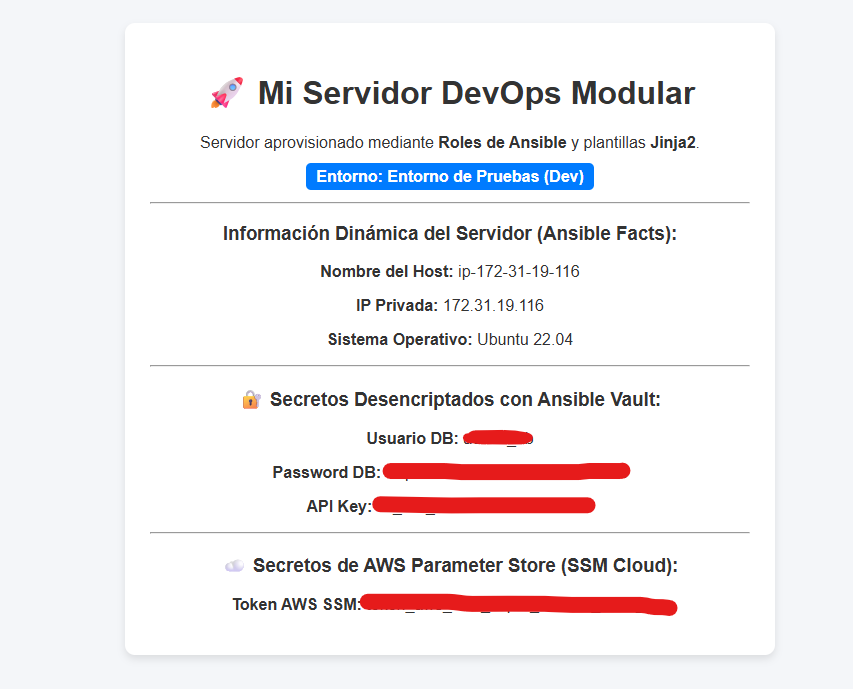

# AWS Infrastructure & Automated Configuration with Terraform, Ansible & GitHub Actions

+ Un pipeline completo de Infraestructura como Código (IaC) y Gestión de Configuración que despliega de forma automática una arquitectura web en AWS, aprovisiona un servidor Nginx con plantillas dinámicas Jinja2, gestiona secretos cifrados con Ansible Vault / AWS SSM Parameter Store y automatiza el flujo completo mediante GitHub Actions.

+ Automatización de infraestructura en la nube AWS combinando **Terraform** para el orquestado IaaS, **Ansible** para la gestión de configuración PaaS mediante inventario dinámico, y **GitHub Actions** como orquestador CI/CD GitOps.

+ El proyecto implementa un patrón de seguridad con **Ansible Vault** y **AWS Systems Manager Parameter Store (SSM)** para evitar la exposición de credenciales en el repositorio.

---

## 📐 Arquitectura del Sistema

El objetivo principal de este proyecto es demostrar una integración limpia entre **Terraform** (para el aprovisionamiento de infraestructura) y **Ansible** (para la configuración de servicios y software), eliminando las dependencias de IPs estáticas mediante **Inventarios Dinámicos** y protegiendo datos sensibles en la nube.

```plaintext
                                   ┌──────────────────────────────────┐
                                   │  GitHub Repository (main branch) │
                                   └────────────────┬─────────────────┘
                                                    │ (push / trigger)
                                                    ▼
                                   ┌──────────────────────────────────┐
                                   │     GitHub Actions Runner        │
                                   └─────────┬──────────────┬─────────┘
                                             │              │
                     ┌───────────────────────┘              └───────────────────────┐
                     │ (1. Apply IaC)                                               │ (2. Configure)
                     ▼                                                              ▼
       ┌──────────────────────────┐                                   ┌──────────────────────────┐
       │     Terraform Engine     │                                   │      Ansible Engine      │
       └─────────────┬────────────┘                                   └─────────────┬────────────┘
                     │                                                              │
                     ▼                                                              ▼
┌───────────────────────────────────────────┐                      ┌───────────────────────────────────────────┐
│              AWS Cloud                    │                      │            AWS Cloud (EC2)                │
│                                           │                      │                                           │
│  ├── EC2 Instance (Tag: Env=production)   │◄─────────────────────┼─── Dynamic Inventory (aws_ec2)            │
│  ├── Security Group (Ports 22, 80)        │                      │   ├── Decrypts Ansible Vault (AES-256)   │
│  └── SSM Parameter Store (SecureString)   │◄─────────────────────┼─── Reads SSM Parameter Store via API      │
│                                           │                      │   └── Deploys Nginx + Jinja2 Template     │
└─────────────────────────────────────────--┘                      └───────────────────────────────────────────┘
```

## 🔑 Componentes Clave
- Orquestación IaaS: Terraform declara la instancia EC2 y los Security Groups en la región `us-east-1`.
- Configuración PaaS: Ansible gestiona la instalación del servidor Nginx mediante un Rol modular y plantillas Jinja2.
- Inventario Dinámico: El plugin `amazon.aws.aws_ec2` descubre automáticamente las IPs públicas de las instancias filtrando por etiquetas (`Environment: production`).
- Gestión de Secretos Híbrida:
    - Ansible Vault: Cifrado simétrico (AES-256) para datos estáticos del repositorio.
    - AWS SSM Parameter Store: Lectura en tiempo real de variables `SecureString` cifradas con AWS KMS.

## 🛠️ Stack Tecnológico
- Cloud Provider: AWS (EC2, Security Groups, SSM Parameter Store, KMS).
- IaC & Config Management: Terraform, Ansible (Roles, Jinja2, Ansible Vault).
- CI/CD & SCM: GitHub Actions, Git.
- Runtime: Python 3, Boto3, Botocore.

## 📁 Estructura del Proyecto

```bash
aws-ansible-gitops-pipeline/
├── .github/
│   └── workflows/
│       └── iac_pipeline.yml     # Workflow ajustado a la raíz/iac
├── .gitignore                   # Archivo de exclusiones de Git
├── README.md                    # Documentación estilo aws-3-tier-terraform
├── docs/
│   └── images/                  # Carpeta para guardar las capturas
│       ├── pipeline-success.png
│       └── website-output.png
└── iac/                         # Carpeta raíz de la infraestructura
    ├── ansible.cfg
    ├── aws_ec2.yml
    ├── main.tf
    ├── site.yml
    └── roles/
        └── nginx_webserver/
```

## 🔧 Prerrequisitos
+ Si deseas ejecutar el proyecto de forma local en tu máquina o WSL:
    - AWS CLI configurado con credenciales (aws configure).
    - Terraform >= v1.5.0
    - Ansible >= v2.15.0
    - Colección de AWS para Ansible instalada: `ansible-galaxy collection install amazon.aws`
    - Librerías de Python requeridas:
    ```bash
    python -m pip install --upgrade pip
    pip install --user ansible boto3 botocore
    ansible-galaxy collection install amazon.aws
    ```

## 🚀 Cómo Levantarlo
+ Vía GitOps (Recomendado)
    1. Configura en tu repositorio de GitHub los siguientes Repository Secrets:
        - AWS_ACCESS_KEY_ID
        - AWS_SECRET_ACCESS_KEY
        - ANSIBLE_VAULT_PASSWORD
    2. Realiza un git push a la rama main modificando cualquier archivo dentro del directorio iac/.

+ Vía Terminal Local:
    ```bash
    cd iac/

    # 1. Crear el archivo de desencriptación local
    echo "tu_password_vault" > .vault_password

    # 2. Desplegar la infraestructura con Terraform
    terraform init
    terraform apply -auto-approve

    # 3. Provisionar con Ansible usando Inventario Dinámico
    ansible-playbook site.yml

    # 4. Destruir recursos al finalizar
    terraform destroy -auto-approve
    ```

## 🌐 Infraestructura Desplegada y Funcionando
+ El pipeline automatizado despliega de forma transparente:
    - Una instancia EC2 Ubuntu Server.
    - Un Security Group con puertos HTTP (80) y SSH (22) abiertos.
    - Un parámetro SecureString en AWS SSM (/produccion/servicios/token_api).
    - Un servidor Nginx sirviendo una plantilla Jinja2 procesada en vuelo.

## 📸 Prueba de que Funciona de Verdad
+ Execution Pipeline en GitHub Actions:
  
  
  

+ Respuesta HTTP del Servidor en Producción:
  

## 💡 Decisiones que Tomé (y Por Qué)
1. Separación de responsabilidades (IaC vs Config Management): Elegí no usar scripts user_data en Terraform para evitar acoplar la creación de la red con la configuración de software. Si la plantilla web cambia, solo se ejecuta Ansible sin destruir la EC2.

2. Uso de Inventario Dinámico sobre IPs Estáticas: Evita tener que actualizar archivos de inventario a mano o pasar salidas de Terraform a Ansible en archivos temporales.

3. Lookup en vuelo para AWS SSM: Las claves de API críticas no se guardan en variables locales; Ansible las consulta directamente a la API de AWS en memoria RAM durante la ejecución.

## 🐛 Lo que No Salió a la Primera (y Cómo lo Arreglé)
+ Problema con la región en el Plugin SSM: Al ejecutar el playbook, Ansible daba el error `ResourceNotFound` al buscar el secreto en AWS.
    - Causa: El AWS CLI local estaba apuntando a una región distinta a la configurada en `main.tf` (`us-east-1`).
    - Solución: Inyecté explícitamente el parámetro de región en la llamada del lookup de Jinja2: `region='us-east-1'`.

+ Conflicto de Perfil de AWS en GitHub Actions: Terraform fallaba en el runner con el mensaje `failed to get shared config profile, personal`.
    - Causa: El código `main.tf` tenía hardcodeado `profile = "personal"`, el cual existía en mi máquina WSL pero no en la VM limpia de GitHub.
    - Solución: Eliminé la línea `profile` para dejar que Terraform use las variables de entorno estándar que inyecta la acción `aws-actions/configure-aws-credentials`.

## Stack
+ Terraform 1.15 · AWS  · GitHub Actions · OIDC · GitHub Environments

## 📊 Estado
🟢 Completado / Producción

## 👤 Autor
+ Miguel — [GitHub](https://github.com/mamoros-dev) · [LinkedIn](https://www.linkedin.com/in/miguel-amoros-moret/)